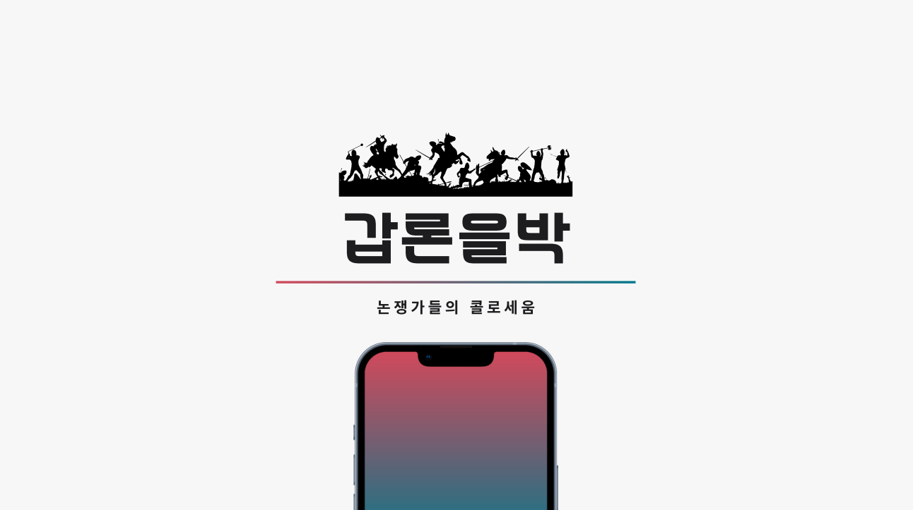
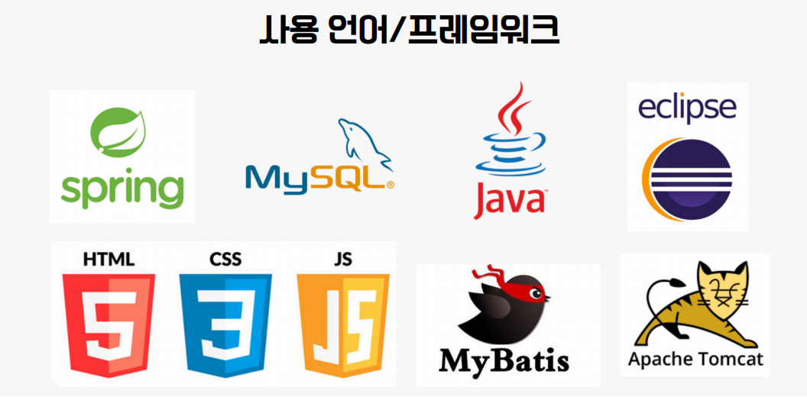
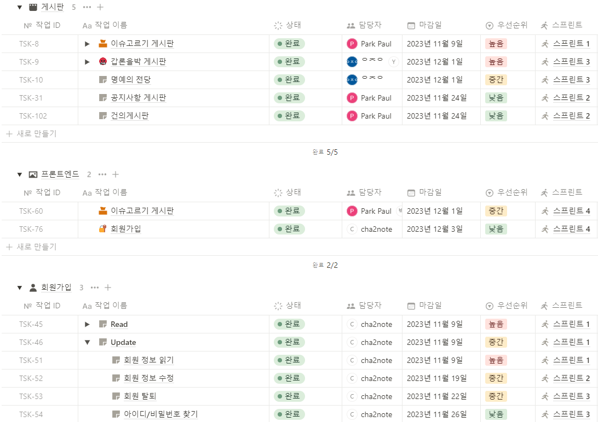
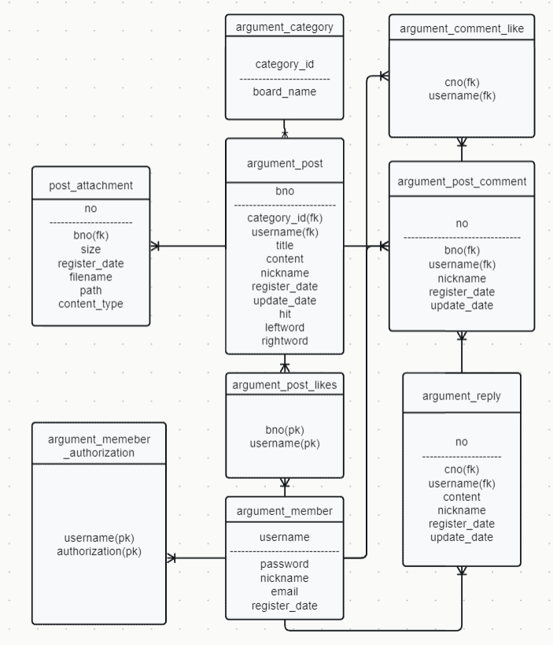
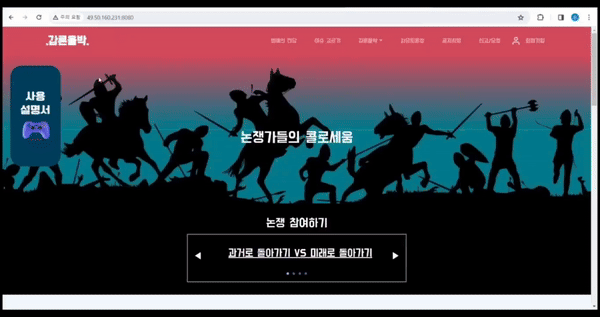
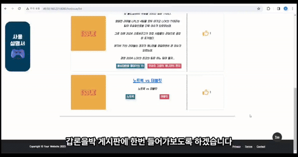
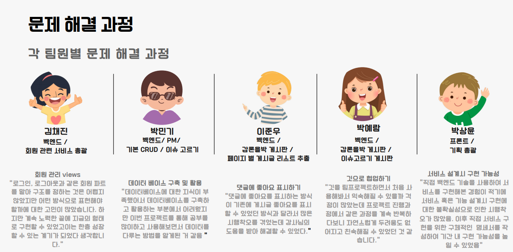

## 🌏 갑론을박 프로젝트 ( 2023.11.01 ~ 2023.12.08 )

> '갑론을박 사이트'는 사용자들이 직접 주제를 직접 이슈를 선정하며 
>  선정한 주제에 대해 자유롭게 토론을 나눌 수 있는 사이트입니다.

 

### 시연 영상
- [서비스 시연 영상](https://youtu.be/eKLK4e96f00) 

 

## 팀원 소개
- 팀명 : T1F4

## 목차

프로젝트 개요

[프로젝트 개요](#1) 
    [1. 주제 선정 동기](#1.1) 
    [2. 개발 환경 및 사용 기술](#1.2) 
    [3. 프로젝트 진행 일정](#1.3)

서비스 설계

[서비스 설계](#2) 
    [1. 설계 산출물](#2.1) 
    [2. 서비스 별 기능](#2.2)

프로젝트 후기

    
[프로젝트 후기](#3) 
    [1. 프로젝트 후기](#3.1) 

## 프로젝트개요

## 1. 주제 선정 동기
💡  2024년 트렌드 코리아의 키워드 중 하나인 '도파밍'이라는 단어에 아이디를 얻어 사용자들이 도파민을 
&nbsp;&nbsp;&nbsp;&nbsp;수집할 수 있는 자유로운 토론의 장을 만드는 것을 목적

 

### 프로젝트 선정 배경 
💡  사용자 본인이 직접 이슈를 제시 하거나 주어진 이슈에 대한 자신의 의견을 주장하는 과정속에서 즐거움을 얻고 
&nbsp;&nbsp;&nbsp;&nbsp;&nbsp;다른 사용자와 소통을 나눌 수 있는 사용자 친화적인 커뮤니티 사이트를 만드는 것을 목표

 

    

## 2. 개발 환경 및 사용 기술

#### Front-end
  

#### Back-end
   

 
 

 

## 3. 프로젝트 진행 일정

 

## 서비스 설계

## 1. 설계 산출물
### E-R Diagram

 

## 2. 서비스별 기능

### ✔ 회원관리 서비스
#### 👤 회원가입
대상 : 일반회원 
내용 : 아이디, 비밀번호, 비밀번호 확인, 닉네임, 이메일 인증
#### 👤 회원정보 수정
대상 : 일반회원 
내용 : 마이페이지에서 회원정보 수정 가능
#### 👤 마이페이지
대상 : 일반회원 
내용 : 기존에 입력했던 아이디, 닉네임, 이메일, 가입일 확인가능
#### 👤 로그인/로그아웃
대상 : 일반회원  
내용 : 기존에 가입했던 아이디와 비밀번호를 통해 로그인

#### 로그인 페이지

 

### ✔ 이슈게시판 서비스
#### 📋 이슈고르기 게시판
대상 : 일반회원 
내용 : 이슈고르기 게시판에서 이슈를 작성
#### 📋 핫이슈게시판
대상 : 일반회원 
내용 : 이슈고르기 게시판에서 작성된 게시물을 좋아요 개수 순으로 정렬

#### 이슈고르기 게시판 화면

### ✔ 갑론을박 게시판 서비스
#### 📋 갑론을박 게시판
대상 : 일반회원 
내용 : 이슈고르기 게시판에서 선정된 주제로 댓글을 통해 사용자들끼리 토론 할 수 있는 게시판

### 갑론을박 게시판 서비스

 

### 프로젝트 후기

